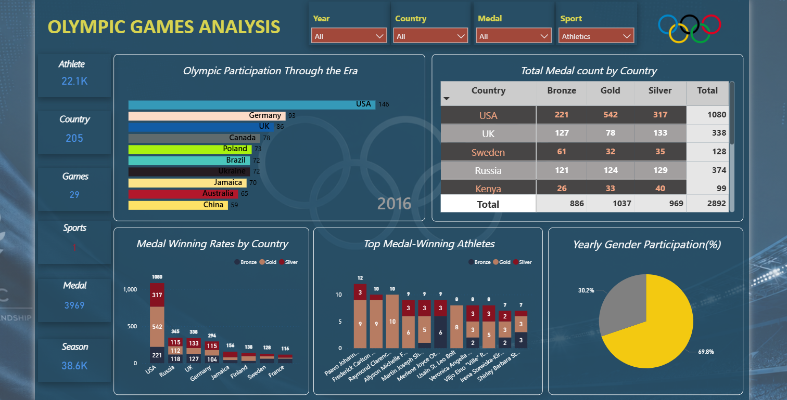

# 🏅 Olympic Games Analysis Dashboard

Interactive Power BI dashboard analyzing Olympic Games history from **1896 to 2016** using SQL and Power BI.  
The project explores athlete participation, medal distribution, country performance, sports trends, and gender participation through dynamic visualizations and KPIs.

---

## 📌 Project Overview

This project was built to uncover valuable insights from historical Olympic Games data by transforming raw datasets into an interactive business intelligence dashboard.

Using Power BI, SQL, and DAX, the dashboard enables users to explore:

- Medal distribution by country
- Athlete participation trends
- Top-performing athletes
- Gender participation analysis
- Olympic participation across different eras
- Country-wise performance comparisons

---

## 🛠️ Tools & Technologies

- Power BI
- SQL
- DAX
- Data Visualization
- Data Cleaning
- KPI Design

---

## 📊 Dashboard Features

- Interactive slicers and filters
- Dynamic KPI cards
- Medal analysis by country
- Athlete performance insights
- Gender participation breakdown
- Olympic trends visualization
- Responsive and clean dashboard design

---

## 📷 Dashboard Preview



---

## 📂 Project Structure

```bash
Olympic-Games-Analysis-PowerBI/
│
├── images/
│   └── Olympic.png
│
├── olympic_games_analysis.sql
├── olympic_games_analysis.sql.pbix
└── README.md
